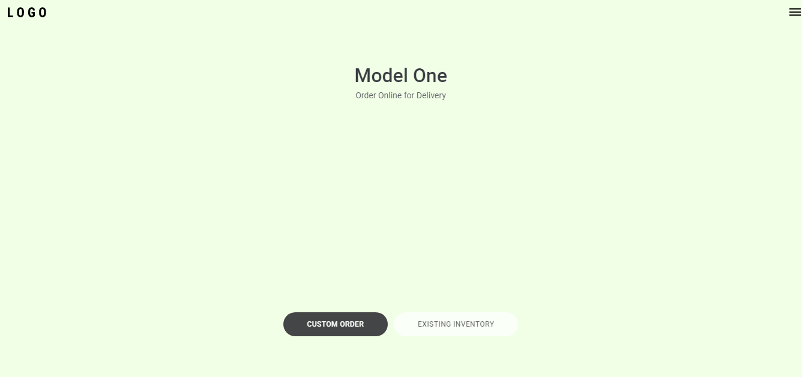

# Clone Testa.


## Descrição do Projeto
<p>Clone do website da tesla, utilizando alguns metodos de scroll.</p>

<p>
  * Obs: Não foram utilizadas as imagens do site oficial por questão de direitos autorais.
</p>

<h2>Demonstração da aplicação</h2>

<div>
  
</div>

## 🎲 Rodando o Front End 

```bash
# Clone este repositório
$ git clone <https://github.com/Bruno-Cesar123/clone-tesla>

# Acesse a pasta do projeto no terminal/cmd
$ cd clone-tesla

# Instale as dependências
$ npm install ou yarn 

# Execute a aplicação em modo de desenvolvimento
$ npm start ou yarn start

# O servidor inciará na porta:3000 - acesse <http://localhost:3000>
```

## 🛠 Tecnologias 

<p>As seguintes ferramentas foram usadas na construção do projeto:</p>

<div>
  <ul>
    <li style="list-style: none"> <a href="https://nodejs.org/en/"> <strong>Node.js</strong> </a></li>
    <li style="list-style: none"> <a href="https://pt-br.reactjs.org/"> <strong>React</strong> </a></li>
    <li style="list-style: none"> <a href="https://www.typescriptlang.org/"> <strong>Typescript</strong> </a></li>
  </ul>
  </ul>
</div>

<p>Este projeto esta sobe a licença MIT.</p>

<p>Feito por <strong>Bruno Cesar</strong> <a href="https://www.linkedin.com/in/bruno-cesar-b0039715a/">Linkedin</a>